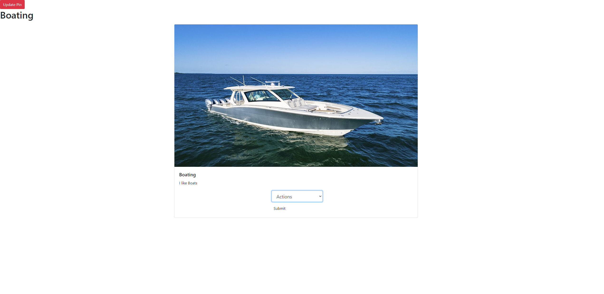

# React-Pinterest
This app was made to solidify our skills with React and data maniplulation using Firebase. It is an app similar to pinterest and has the same core functionality.

## Features
- The authenticated user can:
  - View all pins created by any user
  - Search through pins and boards
  - Create/Update/Delete boards they have made
  - Create/Update/Delete pins they have made
  - Add any public pins to their boards

## Technologies Used
- JavaScript ES6
- ReactJS
- Firebase
- SASS

## Site Link
[React Pinterest](https://reactpinterest.netlify.app/)

## Screenshots
- Home Page

- Edit Pin Page

